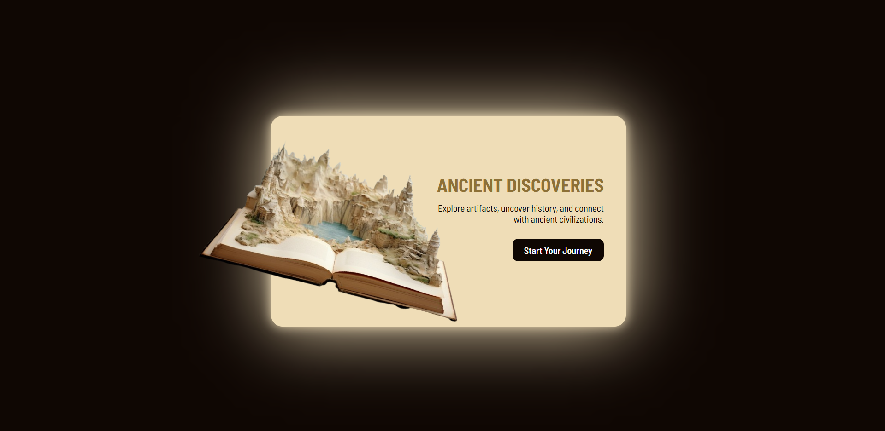

# 🏺 Ancient Discoveries – Archaeological Website

<a href="https://www.linkedin.com/in/dharmendraverma95/" target="_blank">🧑‍💻 LinkedIn Profile </a> | <a href="https://www.behance.net/dhirukumar" target="_blank">🧑‍💻 Behance Profile </a>

Welcome to **Ancient Discoveries**, a digital gateway to the fascinating world of archaeology. This website brings together archaeological findings, artifact galleries, research insights, and educational content to help users explore human history through ancient civilizations.

## 🌍 Project Overview

The goal of this website is to:
- Share archaeological discoveries from around the world
- Provide access to artifact databases and virtual exhibits
- Support educational outreach and public engagement
- Promote heritage preservation

## 📁 Features

- Interactive artifact gallery
- Educational blog posts and research articles
- 3D models
- Mobile-responsive design

## 🛠 Tech Stack

- **Frontend:** HTML, CSS

 
👉 Desktop Design 

📸 Desktop Design 

Cover 

